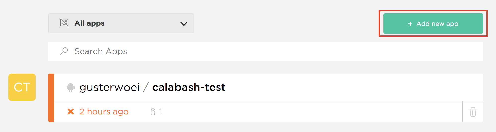

# Calabash Android Test

## Installation

- Install `Ruby`
   - If you're using `Homebrew`, you can install via `brew install ruby@2.3`
- Install `calabash-android` - https://github.com/calabash/calabash-android
- Install `bundler` gem if you have not
- Run `bundle install` to install all required `gem`

## Test Calabash Locally

- Run `./gradlew assembleDebug` to generate an `apk`, the `apk` will be generated in `app/build/outputs/apk/`
- Run `calabash-android app/build/outputs/apk/app-debug.apk` to start calabash test

## Test in `Bitrise` CI

- Firstly, create a new repository in your `Github` account
- Then you'll need to create a `Bitrise` account - https://www.bitrise.io/dashboard
- In your dashboard, click `Add new app`, it will guide you through the process

- You can follow the complete [instructions](http://devcenter.bitrise.io/adding-a-new-app/) here 
- In short, you will need to grant read access to your project repository to `Bitrise`, enable `Git Hook`, this will enable `Bitrise` to trigger build on Git events (eg.push, pull, etc)
- Once you are done, simply push a commit to your Github remote branch, you should see the build is triggered automatically in `Bitrise`

**Bitrise CLI (Optional)**
- Alternatively you can install [Bitrise CLI](https://www.bitrise.io/cli) to test locally on your computer before deploying

## Known Issues

- The latest `calabash-android` version is `0.9.2` and it is dependent on gem `json ~> 1.8.x`. As such, Ruby with version `2.4.x` onwards will have `json` `v2.0` installed by default. This will cause conflict with the one in `calabash-android`
- Currently, the first scenario `Feature: User Login` will fail in `Bitrise` due to UI element timeout for some reason.